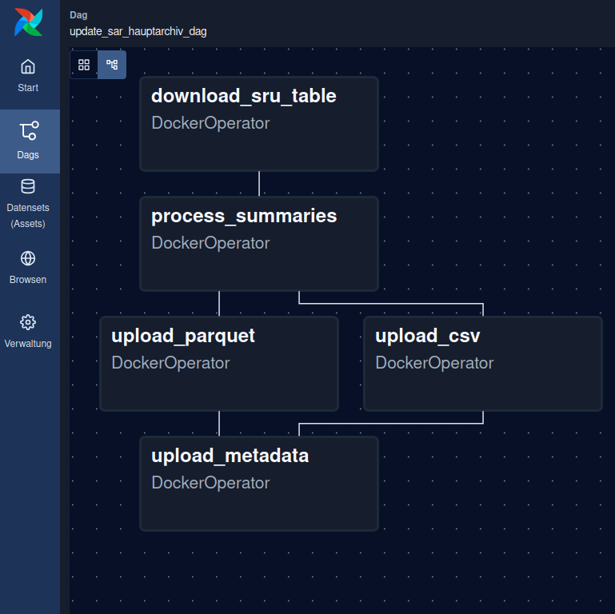
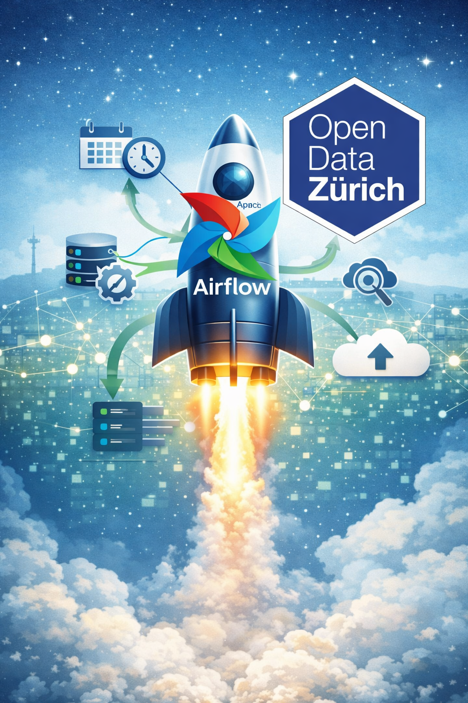

<!-- _class: titlepage -->
# Orchestrierung Open-Data-Aktualisierungen mit Apache Airflow
## CAS Data Engineering HS25
### Use Case Präsentation 
#### Alexander Güntert

[👉 Folien als PDF herunterladen](/Slides.pdf)

  
  

---

# Warum jetzt?

- Open Data Zürich betreibt **zahlreiche historisch gewachsene Aktualisierungsprozesse** über unterschiedliche Kanäle:
  - 📥 Dropzone (WebDAV Harvester)
  - 🤖 GitHub Actions
  - 🦊 GitLab Pipelines
  - ⏰ CRON-Jobs
  - 📤 Manuelle Uploads
- **Zunehmende Anzahl und Komplexität** der Datensätze
- Höhere Anforderungen an Zuverlässigkeit, Monitoring und Nachvollziehbarkeit

➡️ Jetzt ist der richtige Zeitpunkt für eine **Standardisierung und Zentralisierung**

---

# Was passiert, wenn wir nichts tun?

**Pain (Ist-Zustand):**
- Kein zentrales Monitoring
- Fehler werden oft  spät erkannt
- Unterschiedliche Metadatenverarbeitung je nach Kanal
- Kein automatisches Retry bei temporären API-Fehlern
- Gesamte Prozesse müssen bei Fehlern neu gestartet werden

**Erwarteter Win:**
- Weniger manuelle Eingriffe
- Schnellere Fehlerbehebung
- Höhere Stabilität und Transparenz

---

# Welches Problem lösen wir?

- Fehlende **zentrale Orchestrierung** aller Datenaktualisierungen
- Keine einheitliche:
  - Überwachung
  - Fehlerbehandlung
  - Wiederholbarkeit
- Abhängigkeit von **externen Services** (z. B. GitHub Actions)

➡️ Ziel: **Einheitlicher, robuster und skalierbarer Aktualisierungsprozess**

---

# Wie sieht die Lösung aus?
      
**Apache Airflow als zentraler Orchestrator**

- Steuerung aller Aktualisierungen über DAGs
- Einheitliches Monitoring & Logging
- Konfigurierbare Retry-Mechanismen
- Klare Trennung:
  - Orchestrierung (Airflow)
  - Fachlogik (Docker-Container)

**Ergebnis:**
- Standardisierte Pipelines
- Bessere Wartbarkeit
- Zukunftssichere Architektur

---

# Beispiel-Pipeline: Inventar Hauptarchiv Stadtarchiv Zürich

**Warum dieser Use Case?**
- Typischer Open-Data-Aktualisierungsprozess
- Hohe Komplexität (API-Abfrage (SRU), PDF-Downloads, KI-basierte Textzusammenfassungen, CSV & Parquet, Metadaten-Update in CKAN)

➡️ Ideal als **Blaupause für weitere Pipelines**

---

# Technische Umsetzung (POC)

- Eigener Airflow-DAG für den Use Case
- Verarbeitungsschritte als Docker-Container in separatem [Repository](https://github.com/alexanderguentert/cas-de-airflow-container)
- Gemeinsames Volume für Datenaustausch
- Parallelisierung einzelner Tasks (z. B. CSV & Parquet Upload)

**Technologien:**
- Apache Airflow
- Python
- Docker Operator
- CKAN API
- Google Gemini API (für Zusammenfassungen)

---

# Was wurde bereits umgesetzt?

- Vollständiger **Proof of Concept**
- Ein funktionsfähiger Airflow-DAG
- Erfolgreiche Aktualisierung:
  - Daten (CSV & Parquet)
  - Metadaten im CKAN
- Dokumentation & reproduzierbares Setup auf [Github](https://github.com/alexanderguentert/cas-de-airflow/)

➡️ Lösung ist **demonstrierbar und erweiterbar**

---

# Mehrwert der Lösung

- Zusammenführung aller Datenaktualisierungen in einerm Tool
- Zentrales Monitoring
- Einheitliche Metadatenverarbeitung
- Retries oder Teilwiederholungen bei Fehlern
- Unabhängigkeit von Github Actions / Gitlab Pipelines möglich (aber nicht notwendig)

➡️ **Robuste Basis für zukünftige Open-Data-Prozesse**

---

# Call-to-Action

**Nächste Schritte:**
- Vorstellung bei stadtinternen Stakeholdern
- Einbindung in SSZ-Toolstack prüfen
- Testdeployment des PoC auf städtischer CMP
- Definition eines Standard-DAG-Templates
- Einbindung zusätzlicher Datenquellen (Externe APIs, Filesysteme)
- **Perspektivisch:**
  - Integration des städtischen Metadatenkatalogs (SDK)
  - Integration DWH

<figcaption align="right">
<b>Bildquelle</b>: ChatGPT
</figcaption>
